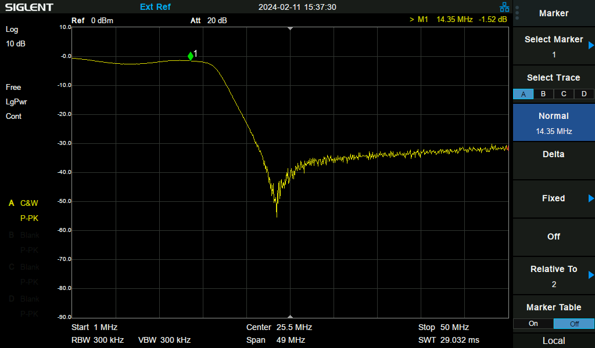

# 5-Band Switching QSE Filter for T41 v11 and Older

This project is an automatically switched, 5-band filter board for V11 and older of the T41-EP.  Installed between the QSE and PA boards, these filters reduce harmonics that cause distortion in the PA output that cannot be removed by the output filter board.

This board is compatible with the V11 and older band switch signaling and uses a similar design to the V11 and older filter board.  The 10m filter is always active, and the 80, 40, 20 and 15 meter filters are switched in and out using relays.  With the current filter design, the 10m filter does introduce some insertion loss (see Insertion Loss below).

## Filter Characteristics
The filters used are from the ARRL Handbook, 99th edition, chapter 10.10.4 Optimized Harmonic Transmitting Filters.  They are low-pass filters (not band-pass), and are constructed using SMD components.  Most inductors are Coilcraft 1008CS series (1008 footprint), except for one Murata 0805 inductor in the 10m filter, as there was no 1008 footprint equivalent.

The following filter sweeps include the 10m filter in place so they reflect the loss characteristics described below for the lower bands.

## Insertion Loss
The PCB design is 2-layer and the RF traces are not impedance matched.  Nevertheless, the board itself shows negligible insertion loss and a relatively flat SWR through 35MHz.

Nevertheless, as can be seen from the filter sweeps above, most of the filters demonstrate approximately 3db of loss.  This is largely due to the presence of the 10m filter, which, as can be seen in the trace above, has a sizeable dip between 5-20MHz.  This characteristic is visible in simulation of the filter so is not due to the construction or part tolerances, and the impact on the other filters has been observed by bypassing the 10m filter.

In the scans below, the 20m filter is shown first with the 10m filter bypassed, and then with it present (note that the trace has a -20dBm offset):

This loss could perhaps be avoided through a different design to the 10m LPF, or by redesigning the board to switch the 10m LPF in only when no other band is active.  In practice, however, I have found little effect from the additional loss and it is easily compensated for through the T41's PA calibration, with no reduction in total power output.
